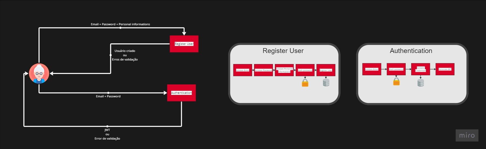
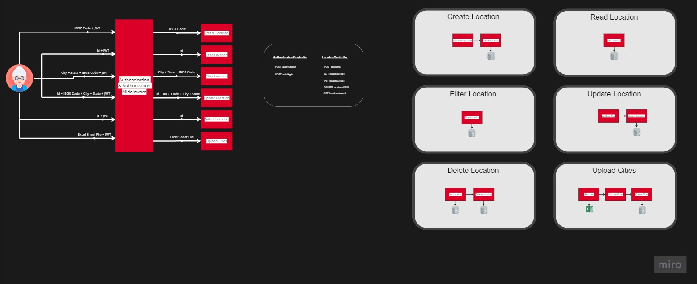
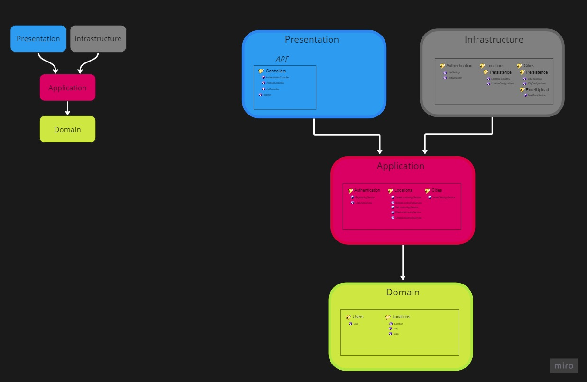

# O Problema
Deve-se criar um CRUD de Localidade, contendo os seguintes campos: Código IBGE, Nome da cidade, Código do estado, Sigla do estado e nome do estado 

* Autenticação e Autorização
  -  Cadastro de E-mail e Senha
  -  Login (Token, JWT)
* CRUD de Localidade
* Pesquisa por cidade
* Pesquisa por estado
* Pesquisa por código (IBGE)
* Importação de dados por excel (.xlsx)
* Boas práticas da AP
  - Versionamento
  - Padronização
  - Documentação (Swagger)
* Minimal APIs
* Testes de unidade

  # Design da aplicação     
  

  

  